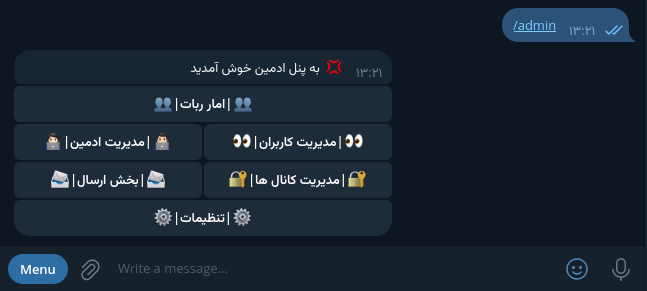
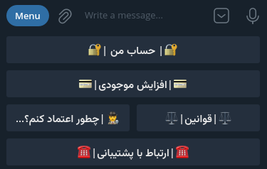

## English | انگلیسی
# 🌟 Base Telegram - Telegram Bot

The Base Telegram bot is a powerful and flexible tool that allows you to easily add or remove default features. This capability accelerates the development of your bot and helps you meet your needs effortlessly.

## 🚀 Features and Capabilities

### 1️⃣ Admin Section

- **Admin Management**:
  - ➕ **Add Admin**: Easily add new admins.
  - ➖ **Remove Admin**: Remove unnecessary admins.
  - 👁 **View Admins**: See the list of current admins.

- **User Section**:
  - 🚫 **Ban User**: Ban troublesome users.
  - 🔓 **Unban User**: Free users who have been banned.
  - 📝 **User Details**: View information about users.

- **Channel Management**:
  - ➕ **Add Locked Channel**: Lock new channels.
  - ➖ **Remove Channel**: Delete unnecessary channels.
  - 👁 **View Channels**: See the list of locked channels.

- **Sending Section**:
  - 📤 **Send to a User by Numeric ID**: Send messages to specific users.
  - 📤 **Send to All Users**: Send public messages to all users.

- **Settings**:
  - ✍️ **Change Rules Text**: Edit the bot's rules.
  - ✍️ **Change Help Text**: Update the bot's help guide.
  - ✍️ **Change Help Channel**: Change the link to the help channel.
  - 🎁 **Change Start Reward**: Adjust the reward amount for starting to use the bot.
  - 🎁 **Change User Invite Reward**: Set rewards for inviting new users.

- **Bot Statistics**:
  - 📊 **Number of Users**: View the total number of users.
  - 📊 **Number of Locked Channels**: Check statistics on locked channels.

---

### 2️⃣ User Section

- 👤 **User Account**: Manage your user account.
- 💳 **Increase Balance**: Increase your balance using methods like Tron or bank transfer.
- 💸 **Withdraw Balance**: Withdraw your balance using various methods (configurable).
- 📈 **Referral Program with Banner**: Attract referrals and earn more income.
- 📜 **Rules**: Access the bot's rules.
- 📚 **Help**: Guide for using the bot.
- 📞 **Contact Us**: Send your support ID for assistance.

---

## 🛠 Setting Up the Bot

To set up Base Telegram, follow these steps:

1. **Navigate to the config folder**:
   - Go to the folder where the bot is located and then enter the config folder.

2. **Edit the config.py file**:
   - Open the config.py file with a text editor.
   - Enter required information such as the bot token and other settings.

3. **Make Changes in Modules**:
   - You can enter the module folder and apply necessary changes, such as entering handlers or buttons.

4. **Run the Bot**:
   - After saving changes in config.py, return to the main bot folder and run the man.py file.

With Base Telegram, experience easier development and management of your Telegram bot than ever before! 🌈

## Persian | فارسی
# 🌟 Base Telegram - ربات تلگرام

ربات تلگرام Base Telegram یک ابزار قدرتمند و انعطاف‌پذیر است که به شما این امکان را می‌دهد تا امکانات پیش‌فرض را به سادگی اضافه یا حذف کنید. این ویژگی باعث تسریع در توسعه ربات شما می‌شود و به شما کمک می‌کند تا به راحتی نیازهای خود را برآورده کنید.

## 🚀 ویژگی‌ها و امکانات

### 1️⃣ بخش ادمین

- **مدیریت ادمین‌ها**:
  - ➕ **افزودن ادمین**: به سادگی ادمین‌های جدید را اضافه کنید.
  - ➖ **حذف ادمین**: ادمین‌های غیرضروری را حذف کنید.
  - 👁 **مشاهده ادمین‌ها**: لیست ادمین‌های فعلی را مشاهده کنید.

- **بخش کاربر**:
  - 🚫 **بن کردن کاربر**: کاربران مزاحم را بن کنید.
  - 🔓 **انبن کردن کاربر**: کاربرانی که بن شده‌اند را آزاد کنید.
  - 📝 **مشخصات کاربر**: اطلاعات کاربران را مشاهده کنید.

- **مدیریت کانال‌ها**:
  - ➕ **افزودن کانال قفل**: کانال‌های جدید را قفل کنید.
  - ➖ **حذف کانال**: کانال‌های غیرضروری را حذف کنید.
  - 👁 **مشاهده کانال‌ها**: لیست کانال‌های قفل شده را ببینید.

- **بخش ارسال**:
  - 📤 **ارسال به یک کاربر با آیدی عددی**: پیام‌ها را به کاربران خاص ارسال کنید.
  - 📤 **ارسال به تمام کاربران**: پیام‌های عمومی را برای تمامی کاربران ارسال کنید.

- **تنظیمات**:
  - ✍️ **تغییر متن قوانین**: قوانین ربات را ویرایش کنید.
  - ✍️ **تغییر متن راهنما**: راهنمای ربات را به‌روز کنید.
  - ✍️ **تغییر کانال راهنما**: لینک کانال راهنما را تغییر دهید.
  - 🎁 **تغییر جایزه استارت ربات**: مقدار جایزه برای شروع استفاده از ربات را تغییر دهید.
  - 🎁 **تغییر جایزه دعوت کاربر**: جایزه‌های مربوط به دعوت کاربران جدید را تنظیم کنید.

- **آمار ربات**:
  - 📊 **تعداد کاربران**: تعداد کل کاربران را مشاهده کنید.
  - 📊 **تعداد کانال‌های قفل شده**: آمار کانال‌های قفل شده را بررسی کنید.

---

### 2️⃣ بخش کاربر

- 👤 **حساب کاربری**: مدیریت حساب کاربری خود.
- 💳 **افزایش موجودی**: با روش‌هایی مانند ترون یا کارت به کارت موجودی خود را افزایش دهید.
- 💸 **برداشت موجودی**: امکان برداشت موجودی با روش‌های مختلف (قابل تنظیم).
- 📈 **زیرمجموعه‌گیری با بنر**: جذب زیرمجموعه و کسب درآمد بیشتر.
- 📜 **قوانین**: دسترسی به قوانین ربات.
- 📚 **راهنما**: راهنمای استفاده از ربات.
- 📞 **ارتباط با ما**: ارسال آیدی پشتیبان برای دریافت کمک.

---

## 🛠 آموزش راه‌اندازی ربات

برای راه‌اندازی Base Telegram، مراحل زیر را دنبال کنید:

1. **وارد فولدر config شوید**:
   - به فولدری که ربات در آن قرار دارد بروید و سپس وارد فولدر config شوید.

2. **فایل config.py را ویرایش کنید**:
   - فایل config.py را با یک ویرایشگر متن باز کنید.
   - اطلاعات مورد نیاز مانند توکن ربات و سایر تنظیمات را وارد کنید.

3. **اعمال تغییرات در ماژول‌ها**:
   - می‌توانید وارد فولدر module شوید و تغییرات مورد نظر را اعمال کنید، مانند ورود به handlers یا buttons.

4. **اجرای ربات**:
   - پس از ذخیره تغییرات در config.py، به فولدر اصلی ربات برگردید و فایل man.py را اجرا کنید.

با Base Telegram، توسعه و مدیریت ربات تلگرام خود را آسان‌تر از همیشه تجربه کنید! 🌈
